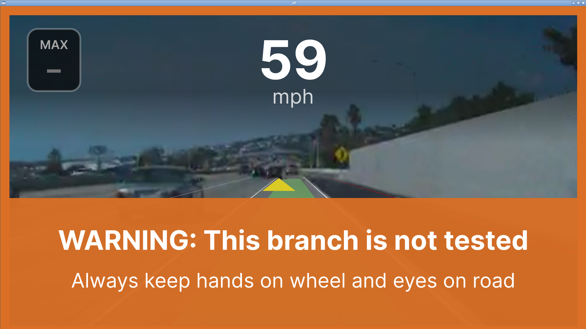

# 實作與驗證紀錄

此文件記錄目前專案從建置到顯示的變更；操作方式見根目錄 README.md。
原始需求保留在 `codex_command/README_OpenPilot_v0.9.1_Install_Replay.md`。

## 1. 平台與來源

- 主機為 macOS ARM64；Docker Desktop 執行 linux/amd64 Ubuntu 20.04。
- compute 處理編譯與資料；display 提供 Xvfb、Openbox、Qt 啟動器、VNC/noVNC。
- 官方 openpilot v0.9.1 tag：`d891d3df476cdaca52dc350bcfdaaa137bbc3840`。
- tag checkout 是 detached HEAD，符合固定版本需求。
- Git remote 已設定為使用者的 ai-self-driving-car repository；目前修改需另行 commit/push。

## 2. 編譯環境

Python 3.8.10、Poetry 1.3.2、SCons 4.4.0，安裝在 container 內。
目前沒有依原筆記另建 sconsvenv；JLL 自訂 Poetry 設定已放入持久化 source volume。
Docker 隔離環境是本專案與原本主機安裝流程的差異。

先前處理過 ARM firmware compiler、Git LFS Catch2 header、libusb headers、
smbus2、setproctitle、acados 的 future_fstrings 編碼標記。
本次完整編譯再補上 Qt 翻譯工具、JPEG、systemd、Qt Charts 與 ncurses 開發套件。
這些修正必須保存在 Dockerfile，不能只靠某次容器內手動安裝。

## 3. 顯示與桌面

- display 與 compute 統一 Ubuntu 20.04，避免 Cap’n Proto/OpenSSL ABI 不一致。
- 補上 Cap’n Proto 0.7、OpenCL loader、Qt QML/Quick/Positioning runtime。
- Xvfb 由 1280×720 改成 1920×1080，避免原始 UI 佈局擠壓。
- VNC 本機 5910 對應容器 5900；noVNC 本機 6080；只綁定 127.0.0.1。
- 依使用者要求設定 VNC 密碼，兩種連線共用。
- 增加 Openbox，提供標題列、移動、最小化、關閉與調整大小。
- 新增 launcher.py，預設只顯示啟動器；官方 UI 原始版面未重新設計。
- 移除浮動退出按鈕，改為監控 UI process；按 UI 的 × 後回到啟動器。
- 實測兩輪「啟動 → 視窗關閉事件 → 返回 → 重開」成功。
- 修正 wmctrl 以錯誤標題尋找 UI 的問題，改用 PID 對應視窗。
- 啟動器的 × 改為最小化，可用 Alt+Tab 或 Openbox 視窗選單找回。

官方 UI 含固定像素大小的元件；可拖曳視窗不代表版面會等比例縮小。
小視窗仍可能裁切，閱讀完整 UI 時建議最大化並在 VNC client 縮放。

## 4. 容器資料與通訊

openpilot-repo 保存原始碼與編譯產物；replay-data 保存 /data；
op-socket 保存健康檢查 socket。
健康檢查 JSON 不是官方 replay 資料流。
官方 msgq 使用 /dev/shm，VisionIPC 使用 /tmp 的 Unix socket 與 FD 傳遞。
因此另配置共享 IPC、PID namespace 及 op-runtime /tmp volume。
端到端 replay 必須另以錄製資料驗證，不能以 health OK 代替。

## 5. 操作與檢查修正

- Docker 檔案集中於 docker/；原始指示保留於 codex_command/。
- validate-docker.sh 改為不重建、不停止服務的檢查。
- 修正先前「修改 entrypoint 不必 build」的說明：COPY 進 image 的檔案修改後必須 build。
- 修正先前「官方完整編譯會產生 replayJLL」的說明：官方 target 名稱是 replay。

## 6. JLL 外部資產整合

已從使用者提供的 `Downloads/InstallOP.docx` 解析出 Google Drive 來源，並將
可取得的資產整合到 compute 的持久化 volume。來源與 hash 詳見
`docs/INSTALLOP_ASSETS.md`。

- `tools092.zip` 已解壓覆蓋 `/opt/openpilot/tools`；原官方 tools 保留於
  `/opt/openpilot/tools-official-backup-20261003`。
- `replayJLL`、`replayJLL230316` 與 `tools/replay/dataC` 已存在，dataC
  實測成功載入 1 個有效 segment 並進入 `playing`。
- `pyproject.toml`、`poetry.lock`、`update_requirements.sh` 已放入
  `/opt/openpilot`。
- `dataB6` 已通過 `unzip -t`，解壓後 129 個檔案、約 2.8 GB，位置為
  `/data/dataB6`；其資料夾命名不符合 JLL `route|segment` 目錄格式，故不
  宣稱可直接由 `replayJLL` 播放。
- DOCX 的 `libvisionipc.a` 與既有已驗證 library 不同；未覆蓋既有檔案，另存
  為 `/opt/openpilot/cereal/libvisionipc.a.jll-source-20261003`。
- `aJLL` 只有資料夾連結，未取得可辨識的公開檔案清單；不能安全推斷其用途。

不能用官方 `replay` 改名宣稱 JLL 完成；目前是「JLL dataC 已驗證、dataB6
已保存但格式待釐清、aJLL 待取得明確檔案」的狀態。

## 7. 本次最終實測結果（2026-10-03）

| 檢查 | 結果 |
| --- | --- |
| 完整 `scons -u -j2` | exit 0，`scons: done building targets.` |
| 官方 replay CLI | `tools/replay/replay --help` 成功 |
| compute / display image | 均重新 build 成功 |
| 健康 socket、Xvfb、Openbox、launcher、UI 動態函式庫 | 檢查通過 |
| noVNC HTTP / VNC port | 6080 HTTP 成功、5910 TCP 成功 |
| UI 關閉返回重開 | 實際發送 WM 關閉事件，連續兩輪成功 |
| 視窗初始尺寸 | PID 對應確認 1600×900 |
| 跨容器 demo | 成功顯示道路影片、59 mph、車道與前車標記 |
| JLL 資產 / dataC | 已整合；JLL dataC 實測進入 playing |
| dataB6 | 已驗證並解壓；尚未宣稱可由 replayJLL 直接使用 |

demo route 為 `4cf7a6ad03080c90|2021-09-29--13-46-36`。
最初高畫質下載的 50 秒限時測試停在下載階段，之後以
`--demo --qcam --no-hw-decoder --no-loop -c 1` 實際進入 playing。
非互動測試設定 `TERM=xterm` 以支援 ncurses。
此為片段驗證，未宣稱全部 11 個 segments 都已播放。
測試後以 SIGINT 停止測試 replay，關閉測試 UI，保留啟動器與兩個服務。

JLL dataC 測試使用：

```text
tools/replay/replayJLL --data_dir tools/replay/dataC \
  "8bfda98c9c9e4291|2020-05-11--03-00-57--61"
```

測試結果為載入 1 個有效 segment、Car Fingerprint `TOYOTA PRIUS 2017`、
狀態 `playing`；命令以測試 timeout 收尾，沒有顯示載入錯誤。



画面警告是回放的官方 UI alert，保留原樣；不代表實車部署已驗證。
本次沒有建立全新空 volume 重新完整編譯；image 可建置與既有 source volume 的
完整編譯已分別驗證。完整編譯成功也不等於所有測試 binary 都已執行。
