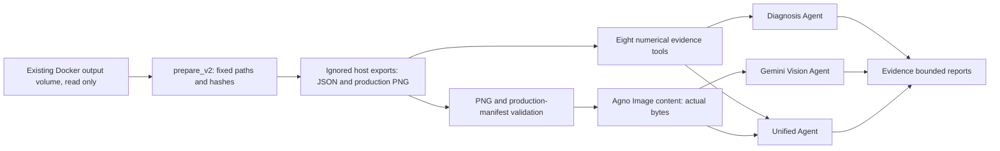

# Do New v2 — Model B6 Diagnosis + Vision Verification Agent

Implemented on `develop` at `33314cd`, 2026-10-06. This extends the existing
student Do New; it preserves baseline_agent.py and evidence_agent.py.

## Course scope and current status

The professor assigns ModelB6 Step 5 training, Step 6 verification, an Agno
Agent baseline, the five-level framework review and original Do New work.
The original student extension exposes saved P2.9 metrics through a read-only
Gemini tool. v2 adds multi-experiment diagnosis, domain comparison, bounded
claim checks, actual image input and a unified numerical/visual mode.
Private professor source/slides are references, not distributed contents.

ModelB6 technical investigation remains closed. Original Evidence Agent live
integration is verified (audit §27), and Baseline complete-answer acceptance
passed on 2026-10-08 (§32). The original 22-group course scope is complete;
v2 is an additional extension whose live status is recorded below: USA/final
Vision PASS; Diagnosis and Taiwan/best Unified await Gemini quota reset after
429 responses. No driving-quality status is promoted.

## Architecture



Host Agent Python 3.11.4 / Agno 3.1.1 / Google GenAI 2.28.0 is retained.
No dependency change or package installation was required. Agno's installed
Gemini `_format_messages` converts Image.content into an inline image/png
part; an offline test checks actual payload bytes. Schema output uses the
already installed Pydantic. PNG integrity validation uses Python stdlib
signature/chunks/CRC/bounded decompression, supporting existing noninterlaced
8-bit RGB/RGBA simulator frames. Other image formats are intentionally rejected.

Professor model history stays `gemini-2.5-flash`. All new live runners use
shared `runtime_model_id()` (default `gemini-3.8-flash`, optional
`GEMINI_MODEL_ID`). Only `GOOGLE_API_KEY` supplies the runtime secret.

## Canonical artifacts and schemas inspected before implementation

Paths below are relative to `/output`. `prepare_v2.py` exports exact bytes
with source path, SHA-256 and byte count into ignored
`projects/project2/agent/artifacts/do-new-v2/`. Existing different exports are
rejected rather than overwritten. No arbitrary source/root parameter exists.
The Docker reader uses `--network none`, `--read-only` and the existing
`ai-self-driving-car_modelb6-output` volume mounted `readonly`.

| Category | Canonical artifact | Consumed schema |
| --- | --- | --- |
| Step 5 | `step5/runs/p25-baseline-20261005/run.json` | complete status, epoch histories, best epoch/loss, splits, hashes and resume semantics |
| Step 6 | `step6/report.json` | matrix_complete, four cells/comparisons, descriptive domain response, unavailable ground-truth accuracy |
| Domain verification | `step6/{usa,taiwan}/comparison.json` | domain, final/best metrics, frame range, model hashes; accuracy remains unavailable |
| P2.7 | `p27-sensitivity/results.json` | complete status, roles → domains → intervention records → full MAE/RMS/max |
| P2.8 | `p28-encoder-audit/results.json` | input_scale; trained/fresh encoder traces with layer/baseline/comparison RMS |
| P2.8 fresh controls | `p28-encoder-audit/reference_controls.json` | complete status, fresh-control records and caveat |
| P2.9 | `p29-gradient-audit/summary.json` | complete status, sample/record counts, role/domain/condition aggregates and medians |
| P2.9 interpretation | `p29-gradient-audit/interpretation.json` | completed interpretation and conditional shortcut claim |
| P2.10 | `p210-gradient-controls/summary.json` | three seeds, zero training steps, no optimizer, aggregate stem/late gradient RMS |
| Vision | `step6/{usa,taiwan}/{final,best}/frame_*.png` and sibling `manifest.json` | production/completed identity and manifest artifact hashes |

Export comprises **26 files: 10 numerical JSON + 4 production manifests +
12 existing PNGs**. Smoke/quarantine frames and professor-private images are
excluded. No `B6Sim.png` filename is assumed: the student Step 6 four-panel
frames are the actual simulator-equivalent outputs. The USA/final first frame
was inspected locally to verify that it contains original/overlay scene,
camera geometry and top-down path/lane panels. This inspection is not a
Gemini live test. Paired comparison PNGs exist but v2 currently accepts only
individual checkpoint frames authenticated by production manifests.

## Diagnosis tools and evidence boundaries

| Tool | Purpose |
| --- | --- |
| get_training_evidence | Actual train/validation histories, final/best gap and split limitations |
| get_verification_evidence | Four-cell technical verification and descriptive metrics |
| get_sensitivity_evidence | Intervention metrics for final/best × USA/Taiwan |
| get_encoder_evidence | Progressive layer response, native input scale, trained/fresh controls |
| get_gradient_evidence | Domain/condition supervised-gradient medians and conditional state effects |
| get_fresh_gradient_evidence | Compute log10(late_rms/stem_rms) from three saved fresh controls |
| compare_domains | Combine domain verification, sensitivity and gradient evidence |
| check_diagnostic_claim | Audited claim IDs with supported/partial/unsupported/unknown classification |

Every tool returns provenance and limitations. Missing artifacts produce an
explicit unknown section in offline reports; malformed/incomplete/nonfinite
or checksum-mismatched evidence fails rather than generating an answer.
The claim catalogue is a bounded review policy grounded in the completed
experiments, not an unrestricted natural-language causal classifier.
Unknown claim IDs are unknown, never invented facts. Claim IDs:
`image_invariance`, `state_dependence`, `training_caused_collapse`,
`initializer_sole_cause`, `driving_quality`, `overfitting`, `universal_shortcut`.

The offline Diagnostic Report includes all evidence categories, cross-domain
comparison, fresh-vs-trained findings, supported diagnosis, alternatives,
unsupported claims, quality limits and next action. The live report uses the
same eight specialized tools; it has no filesystem/inference/training tool.

Actual source cross-checks:

- Step 5: 60 epochs; best epoch 25, validation **0.5254096388816833**;
  final validation **71.71458435058594**. This supports instability/possible
  overfitting, not a definitive cause. One validation sequence and sampled
  batches limit generalization claims.
- P2.7: near image-invariance in controlled pairs in both tested domains;
  state interventions materially affect outputs. It is a sensitivity finding.
- P2.8: progressive encoder attenuation occurs in trained and fresh models;
  preprocessing scale agreement rules out the tested scale mismatch explanation.
- P2.9: tiny nonzero local image gradients; conditional state effects.
  Universal shortcut learning and target leakage are not confirmed. Do not
  call small nonzero gradients machine-precision zero or claim all output
  causality follows from a gradient ratio.
- P2.10: fresh-control top-to-stem attenuation is **9.4032603088,
  9.3036137983, 9.3215033007 orders** for seeds 3101/3102/3103.
  Severe attenuation predates training in the architecture/default-initialization
  combination. The initializer alone is not isolated as sole cause.
- USA is train-seen, Taiwan uses different projection. Diagnostic consistency
  across them is not driving-quality generalization. Teacher targets are not
  independent human ground truth.

## Vision and unified report

Only relative canonical production frame paths are accepted. Absolute paths,
`..`, root/file/parent symlinks, arbitrary filesystem/professor reads,
unapproved images, oversized/corrupted PNGs and mismatched hashes are rejected.
Input validation reads bytes once; those bytes are passed as
`Image(content=raw, mime_type='image/png')`, avoiding a later path reread.

Vision uses a Pydantic VisualVerificationReport with scene, path, left/right
lane, lead, failure pattern, confidence and limitations fields. Report envelopes
add authenticated image/source/domain/checkpoint/SHA-256 and mandatory
qualitative limits. Unified mode adds the eight tools and fields for numerical
agreements/disagreements and bounded interpretation. A single frame cannot
establish temporal zigzag; report visible spatial discontinuities separately.
Lead conclusions must have visible support; no lead overlay means unknown.

Live output requires Agno RunStatus.completed and valid report schema.
**A valid schema alone does not close live acceptance**: a human must verify
that the answer uses the actual image and retains evidence boundaries.
Offline mode validates inputs/schema only and returns `report: null`,
`gemini_executed: false`; it does not pretend to inspect an image with an LLM.

Multimodal inspection is **qualitative verification**. It is not quantitative
ground truth, closed-loop validation, proof of safety/driving quality, or a
replacement for numerical evaluation. Encoder attenuation is a plausible
bounded explanation, not established cause of every visible mismatch.

## Offline commands (repository root)

```sh
projects/project2/agent/.venv/bin/python projects/project2/agent/prepare_v2.py
projects/project2/agent/.venv/bin/python projects/project2/agent/diagnosis_agent.py --offline
projects/project2/agent/.venv/bin/python projects/project2/agent/vision_agent.py --list-images
projects/project2/agent/.venv/bin/python projects/project2/agent/vision_agent.py --image step6/usa/final/frame_00001.png --offline
projects/project2/agent/.venv/bin/python -m unittest discover -s projects/project2/agent -p '*_tests.py' -v
projects/project2/agent/.venv/bin/python projects/project2/agent/prepare_v2.py --verify
projects/project2/agent/.venv/bin/python projects/project2/agent/prepare_demo.py --verify
```

## Live commands (fish, repository root)

Use the existing configured terminal; do not paste the key into chat/files.
If it is absent, collect it without echo or a literal value in command history:

```fish
if not set -q GOOGLE_API_KEY
    read --silent --prompt-str 'GOOGLE_API_KEY: ' GOOGLE_API_KEY
    set -gx GOOGLE_API_KEY $GOOGLE_API_KEY
end
# Optional model override; otherwise shared default is used.
set -gx GEMINI_MODEL_ID gemini-3.8-flash
projects/project2/agent/.venv/bin/python projects/project2/agent/diagnosis_agent.py
projects/project2/agent/.venv/bin/python projects/project2/agent/vision_agent.py --image step6/usa/final/frame_00001.png
projects/project2/agent/.venv/bin/python projects/project2/agent/vision_agent.py --image step6/taiwan/best/frame_00001.png --unified --question 'Combine this image with existing P2.7–P2.10 evidence and give a bounded engineering diagnosis.'
```

At implementation time no key was inherited, so no live call was made by the
implementation task. The user subsequently supplied three live results: Diagnosis
503, USA/final Vision PASS, Taiwan/best Unified 503. See audit §30. No additional
API call was made to assess that receipt.
Gemini 503/high demand is a known external availability limitation, not proof
of local adapter failure; preserve errors and never certify partial output.
Nonstreaming new runners reduce ambiguity from partial streaming panels, but
cannot guarantee provider availability.

## Demo questions

Pass a question via diagnosis_agent.py `--question`:

1. Does ModelB6 depend more on the current image or recurrent state? Use evidence and limitations.
2. Did training cause the severe image-gradient attenuation?
3. Compare USA/Taiwan diagnostics. Does this establish driving-quality generalization?
4. Is the initializer proven to be the sole cause of image attenuation?
5. Generate the complete Model B6 Diagnostic Report.

For vision_agent.py, select an approved `--image` and optionally `--unified`:

6. Analyze this simulator verification image: do predicted path/lanes appear consistent with the visible road?
7. Combine this image with P2.7–P2.10 evidence and provide a bounded engineering diagnosis.

## Validation and remaining work

**55/55 offline tests PASS: 20 preserved + 35 v2 tests.** Synthetic fixtures
are explicitly test data; real saved exports were separately consumed through
all seven report sections and all 12 image validators. Tests cover discovery,
canonical provenance, missing/malformed evidence, absolute/traversal/symlink
rejection, read-only behavior, checksums, claims/quality/domain boundaries,
PNG integrity, schema validation, actual Gemini image serialization, mocked
byte attachment, failure-status rejection, missing-key skip and refusal to
replace a different export manifest. No test makes an API call.

The existing 269-file protection check passed before and after implementation,
including trained checkpoints, original datasets, professor material and prior
experiment evidence. New export verification passed for 26 files. No ModelB6
experiment/test rerun was necessary; only stdlib evidence readers ran in Docker.
Host before-edit hashes and final diff/secret checks are recorded in audit §29.

Verified Vision live receipt: **Vision USA/final PASS**. Image SHA-256 matches the
canonical frame; observations of overcast highway, yellow left boundary,
red/green/blue spatial jaggedness and no lead-specific overlay match the image.
The report distinguishes spatial from temporal behavior and retains qualitative
limits. Its upstream-instability suggestion is a hypothesis, not proven causality.

Diagnosis and Unified each returned **503 UNAVAILABLE/high demand**. Diagnosis
previously rendered the error JSON as a Response; the student v2 runner now
checks RunStatus.completed and nonempty text before returning a report, exposes
only tool names/error flags for review, and exits with failure on incomplete
runs. Three added offline tests cover error, empty and completed responses.
The submitted Unified traceback confirms its existing completion gate rejected
the failed run; no successful Unified report was produced. The SDK AFC warning
before the successful Vision output is not a failed request by itself.

The subsequent Diagnosis/Unified receipt returned **429 RESOURCE_EXHAUSTED**,
with `GenerateRequestsPerDayPerProjectPerModel-FreeTier`, limit **20** for this
project/model. Provider RetryInfo at request time was **55530 s / 55506 s**
(about 15 h 25 min), not a delay measured from when this document is read.
Exact request timestamps were not supplied, so an absolute reset time is not
inferred. This is the current blocker; previous 503s remain historical.
The corrected Diagnosis gate and existing Unified gate reject these runs.
Neither retry produced a report. Stop immediate retries until quota reset.

[Google's rate-limit documentation](https://ai.google.dev/gemini-api/docs/rate-limits)
states quotas apply per project, with daily requests resetting at Pacific
midnight. The limit 20 here is from the submitted API error, not a universal
model limit. Actual usage/limits can be checked in AI Studio. Changing a key
in the same project does not change the documented project quota. No billing
change or model/dependency change was performed or is needed for this review.

Remaining: completed live Diagnosis and Unified responses; the original baseline
still needs its complete answer. Vision acceptance covers this single USA/final
image and its qualitative report, not every checkpoint/domain or driving quality.
Use existing commands after quota reset when provider availability permits;
no model/version change, P2.11/retraining or new driving-quality claim is
justified by these provider failures.

## Future Bonus — YOLO + OpenPilot Agent

A later independently authorized extension could add object-detection evidence
with source/frame identity, confidence and provenance, then compare it with
these reports. Nothing here installs ultralytics/PyTorch, downloads weights
or performs YOLO inference. Qualitative lead observations remain distinct
from independent detection and ground-truth evaluation.
